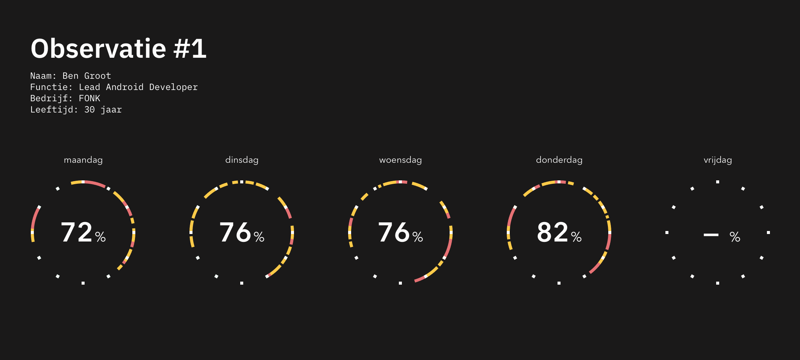

# Veldonderzoek

	Daan Rongen
	Afstudeerstudent Communication & Multimedia Design,
	minor Intelligent Environments, 
	focus op IoT-design en design-ethiek.
		
	Onder begeleiding van: Harold Konickx
	In opdracht van: Healthy Workers
	Onder supervisie van: Niels de Keizer & Boy Lokhoff

---

<a href="https://github.com/daanrongen/delta/blob/master/library/design-brief.md">design-brief</a> || <a href="https://github.com/daanrongen/delta/blob/master/library/design-rationale.md">design-rationale</a> || <a href="https://github.com/daanrongen/delta/blob/master/library/literatuuronderzoek.md">literatuuronderzoek</a> || <a href="https://github.com/daanrongen/delta/blob/master/library/veldonderzoek.md">veldonderzoek</a>

---

In dit **veldverslag** beschrijf ik de belangrijkste bevindingen uit mijn onderzoek naar kantoormedewerkers en hun (zit)gedrag tijdens werkuren op kantoor.

{{TOC}}

###### 17-04-2018
## Interview kantoormedewerkers B.Amsterdam
Na het literatuuronderzoek ben ik bij B. Amsterdam in gesprek gegaan met kantoormedewerkers. Mijn doel was om tijdens een één-op-één gesprek meer te weten te komen over wat voor data kantoormedewerkers zouden willen ontvangen over hun (fysieke) werkomgeving en of ze bereid zijn in actie te komen om hun werkomgeving te verbeteren. Ik had ze het volgende scenario voorgelegd:

"Je werkt full-time in een kantooromgeving waar je geen ramen open kunt zetten, de verwarming centraal geregeld wordt en veel planten hebt staan. Er komt een bedrijf langs dat sensoren ophangt in elke ruimte. Ze zijn volledig transparant in hoe de technologie van de sensoren werkt. De sensoren zouden hypothetisch gezien alle natuurkundige en klimatologische omstandigheden kunnen meten.”

In totaal heb ik 14 respondenten geïnterviewd.

###### 19-04-2018
### Sensordata Werkomgeving
Het is mij opgevallen dat de respondenten niet erg creatief durven te zijn met het bedenken van sensoren die omgevingsstressoren kunnen meten. Populaire antwoorden waren: temperatuur, CO₂, luchtvochtigheid en metingen als "luchtvervuiling" en "zuurstofgehaltes", die onder luchtkwaliteit vallen. Uniekere antwoorden waren: lichtintensiteit, lichtkleur, lichtverdeling, geluid en akoestiek, de klimatologische omstandigheden om een plant mee te verzorgen, het aantal mensen op een plek (occupancy, reuring) en ergonomie (zithouding). Toen ik vroeg of ze zelf ook last hebben van de door hen eerder genoemde stressoren, bevestigden ze dit.

De informatie dient volgens bijna alle respondenten voornamelijk visueel te worden weergegeven. Sommigen geven aan grafieken te willen zien waarin waarden over tijd worden weergegeven met labels over welke waarden goed en slecht zijn. Anderen geven aan dat ze graag "meters" of spectra willen zien, waarop wordt weergegeven wat de huidige waarde is op een horizontale as, en direct gerelativeerd kan worden met wenselijke en onwenselijke waarden.

### Actie Ondernemen
“Stel dat je op de manier die je net hebt genoemd een "slechte" omgevingswaarde zou zien. Heb je de behoefte om direct actie te ondernemen om deze te verhelpen of te verminderen?"

Alle respondenten hebben aangegeven dat ze actie zouden ondernemen op het moment dat ze vanuit hun omgeving feedback krijgen dat er omgevingsstressoren aanwezig zijn, of binnenkort zullen zijn. De acties die ondernomen zouden worden verschillen echter:

**1. Passief (via superior):**
Vier van de veertien respondenten geven aan actie te ondernemen door naar een manager of ander verantwoordelijk persoon te stappen om een melding of klacht door te geven. Ze hebben het idee dat ze zelf niet in staat zijn om het probleem aan te pakken. Sommigen denken wel de capaciteit te hebben om de stressor te verhelpen, maar vinden dat zij alsnog niet het aangewezen persoon zijn om deze actie te verrichten.

**2. Passief (verplaatsing):**
Vijf respondenten hebben aangegeven zich te verplaatsen van de plek waar een stressor plaatsvindt of zal plaatsvinden. De reden dat deze respondenten dat de meest logische keuze vinden, is omdat ze er erg in geloven dat veel stressoren subjectief zijn. Het is dan niet ondenkbaar dat het individu in kwestie als enige last heeft van deze stressor. De respondenten menen dat In plaats van de omgeving aanpassen, dat ook van toepassing is op anderen, het ze beter lijkt om zelf een omgeving met minder stressoren op te zoeken.

**3. Actief:**
Vijf van de veertien ondervraagden geven aan zelfstandig actie te ondernemen. Een deel hiervan geeft aan dat ze hierbij ook juist de sociale context interessant vinden. "Samen verantwoordelijk zijn voor een aangename werkomgeving" is een doel dat ze willen bewerkstelligen. Sommigen geven echter wel aan dat ze graag eerst willen overleggen met de rest van de medewerkers of de stressoren unaniem worden ervaren.

### Conclusie
Er zijn verschillende manieren mogelijk om de informatie over deze omgevingsfactoren naar de gebruiker te brengen, het hangt af van workflow, urgentie en in hoeverre de kantoormedewerker actie kan ondernemen om comfort te optimaliseren. Kantoormedewerkers hebben verschillende standaarden van comfort, maar hebben moeite met deze standaarden uit te drukken.

Tot slot zijn niet alle kantoormedewerkers evenveel gebaat bij een oplossing waarbij ze zelf actie moeten ondernemen. Er zijn kantoormedewerkers die wel meer comfort willen, maar vinden dat hun werkgever hiervoor moet zorgen. Ook zijn er kantoormedewerkers die moeite hebben met inschatten of zij de enigen zijn die de omgevingsstressor ervaren, en om deze reden het probleem uit de weg gaan door zich te verplaatsen.

###### 30-05-2018
## Concept Validatie
Startend op 4 juni begin ik met het valideren van de huidige oplossing-richting. Het concept leunt nu op twee hypothesen, deze zijn:

Hypothese 1:
> **Door persoonlijk inzicht te geven in zitgedrag zijn kantoormedewerkers meer geneigd om verbetering aan te brengen in hun fysieke welzijn.**

Hypothese 2:
> **Kantoormedewerkers attenderen hun collega’s op hun zitgedrag als dit aantoonbaar ergonomisch-onverantwoord begint te worden.**

###### 04-06-2018
### Experiment 1: Inzichten Zitgedrag
Op het kantoor van FONK Amsterdam heb ik een vrijwilliger gevonden wiens zitgedrag ik mag bestuderen tussen maandag 4 juni en vrijdag 8 juni. Tussen 09:00 uur 's ochtends en 18:00 uur 's avonds zal ik bijhouden op welke momenten hij zit en hoe lang hij zit. Aan het einde van de werkdag gaan we gezamenlijk de inzichten doornemen. Ik zal hem dan de volgende vragen stellen:
1. Wat kun je mij vertellen over het onderstaande figuur? (*Usability vraag*)
2. Wat gaat er door je heen als je deze inzichten bekijkt?
3. Heb je de behoefte om deze inzichten vanaf nu elke dag te ontvangen?
4. Wat zou je nog meer willen zien in dit figuur met betrekking tot het zitgedrag dat je vandaag vertoond hebt?

#### Maandag 4 juni
- Zitpercentage: 72%
- Ben vond het zitpercentage hoger dan verwacht, hij dacht dat hij meer had gestaan dan dat.
- Ben geeft aan dat hij zich bewust is van de vermindering in bloedcirculatie bij een sedentaire houding en zegt soms behoefte te hebben aan wat sport op het midden van de werkdag, hij doet dit echter nooit.
- Ben geeft ook aan dat hij regelmatig timers gebruikt om regelmatig geattendeerd te worden op zijn zitgedrag. Hij zegt echter dat deze timers 'altijd ongelegen afgaan' en dat hij de tool daarom uit zet.

#### Dinsdag 5 juni
- Zitpercentage: 76%
- Ben zag direct het verschil tussen zijn zitgedrag op dinsdag en zijn zitgedrag van maandag. Hij zei dat hij maandag vaak langer zat, en vervolgens langer stond, terwijl hij op dinsdag over de hele dag vaak in periodes van 20 tot 40 minuten zat, en dan even stond.
- Ben gaf aan de dinsdag, ondanks dat hij percentueel meer heeft gezeten, een aangenamere dag vond wat betreft zitgedrag.
- Toen ik vroeg wat Ben graag nog meer zou willen zien in de visualisatie zei hij dat hij behoefte had aan een feature waarmee hij kon zien wanneer hij "te lang" zit. Ik heb hier onderzoek naar gedaan en het blijkt dat kantoormedewerkers na 30 minuten zitten even kort dienen te staan.

#### Woensdag 6 juni
- Zitpercentage: 76%
- Ben ging met last van zijn nek naar huis. Hij gaf aan dat dit werd veroorzaakt door zijn werk achter de computer. 
- Bij het opmaken van de data-visualisatie implementeerde ik de feature waarmee zichtbaar wordt dat er langer dan 30 minuten is gezeten. Ben zag direct dat ik "te lang zitten had toegevoegd" en hij zei dat hij zijn zitgedrag van de dinsdag nog steeds het meest wenselijk vond.
- Hij gaf aan niet erg tevreden te zijn over zijn zitgedrag van woensdag, mede door de last van zijn nek.
- Ben is om 12:20 gaan boksen in de boksruimte bij FONK.

#### Donderdag 7 juni
- Zitpercentage: 82%
- Ben gaf in de ochtend al aan dat hij verwacht veel te zitten deze dag.
- 

#### Vrijdag 8 juni
- Zitpercentage: --%;
- Ben was afwezig op vrijdag, ik zal op maandag 11 juni met hem afspreken om een selectie aan vragen te stellen over dit onderzoek: zie onderstaande tabel.

###### 12-06-2018
#### Medewerker Interview (Ben Groot, FONK)

| Vraag | Antwoord |
|:--|:--|
| Zijn de resultaten van dit onderzoek verrassend voor jou? Waarom wel of niet? | Nee, ik had al verwacht dat mijn zitpercentages rond de 80% zouden zitten. Ik zie wel dat het op maandag wat lager lag, maar de rest van de week ligt het rond  de 80%. |
| Zou je deze inzichten vaker willen ontvangen? Waarom wel of niet? | Niet elke dag, dat is te frequent. Maar aan het einde van de week of maand een overzicht zou waardevol zijn. |
| Welke trend(s) zie je in de inzichten? | De percentages worden steeds hoger naarmate de week vordert en de velden zijn vaker rood naarmate de week vordert. Dit komt omdat ik aan het begin van de week veel meetings heb en later op de week steeds meer geconcentreerd aan het werk ben. |
| Is zitgedrag iets waar je aan wilt werken tijdens kantooruren? Zo ja, hoe zou je dit aanpakken? | Het is zeker iets waar ik aan wil werken. Ik gebruikte voorheen een timer-notificatie om me te helpen herinneren dat ik regelmatig pauze moet nemen, maar deze gebruik ik niet meer omdat de timers altijd ongelegen kwamen. |
| Heb je het idee dat deze inzichten helpen bij het stimuleren van betere ergonomie in kantooromgevingen? | Deze inzichten hebben me getoond dat ik vaak te lang zit, dus daar zal ik nu meer op letten. Maar het heeft me niet per se gestimuleerd om meer te bewegen op een dag. |
| Wie zouden deze inzichten mogen zien van jou? Wees specifiek in hoe vaak deze partijen inzichten mogen bekijken. | Mij zou het niet veel uitmaken wie deze inzichten zien. Ik kan me prima voorstellen dat anderen liever niet hebben dat collega's of werkgevers de data kunnen bekijken. |

###### 12-06-2018
#### Conclusie

###### 13-06-2018
## Expert Feedback (Marc Apon, Lead UX FONK)

> "Actionable Data" is data, afkomstig uit een Quantified Self toepassing, waarbij de gebruiker kiest voor een aanpassing in zijn/haar gedrag. In het scenario van Ben Groot is te zien dat hij soms te lang zit. Ben verklaarde zelf dat soms een 'te lange zit' tijdens een meeting met collega's en/of een klant plaatsvindt. Het is dan moeilijk om ervoor te kiezen om te gaan staan om te lang zitten te voorkomen. Als hij echter te lang achter zijn werkplek zit, heeft hij wel de mogelijkheid om te gaan staan. De data met betrekking tot zit-inzichten tijdens een meeting zijn niet actionable. Met andere woorden, actionable data is een inzicht waarop gehandeld kan worden. Je zou kunnen stellen dat bij user-centred design het product is afgestemd op het tonen van zo veel mogelijk actionable data.

###### 19-06-2018
## Expert Interview (Mariska van de Kaa, Vita 2 Move)

### Doel van het interview:

Inzichten krijgen in welke meetpunten het meest belangrijk zijn voor het verbeteren van fysieke activiteit in de kantooromgeving. Mijn huidige literatuuronderzoek stelt het volgende:

> Steeds meer werkenden werken in een sedentaire sector, voornamelijk in kantooromgevingen, zowel dit absolute als relatieve getal zal naar schatting blijven stijgen. Er is een significante correlatie tussen sedentair werk en de ontwikkeling van hart- en vaatziekten. De musculoskeletal disorders (skeletvergroeiingen) die ontstaan door het langdurig werken in een ergonomisch-onverantwoorde zithouding vormt de grootste oorzaak van werk-gerelateerd letsel in kantooromgevingen. Skeletvergroeiingen zijn te voorkomen door ergonomische interventies zoals betere bureaustoelen, bureaus, muizen, toetsenborden, etc. Langdurig in een sedentaire houding zitten reduceert de fysieke activiteit van het individu tot het minimum, dit heeft invloed op de bloedsomloop. De gemiddelde kantoormedewerker spendeert dagelijks 77,0% van haar werktijd en 63,2% van haar niet-werktijd zittend. Vandaar: "ergonomisch zitten is goed, dynamisch zitten is beter". De fysieke activiteit van de kantoormedewerker dient toe te nemen. Dit kan middels verschillende interventie-soorten. Tot nu toe heeft het inspelen op de technologische "Quantified Self"-trend het beste resultaat opgeleverd. Hoe kun je fysieke activiteit inzichtelijk maken voor kantoormedewerkers die full-time bij een corporate bedrijf werken, door middel van een web-app die verbonden is met een IoT-device, om fysiek welzijn in de werkomgeving te optimaliseren?

### Belangrijkste learnings
Het [complete interview](https://github.com/daanrongen/delta/blob/master/library/interview.md) is uitgeschreven. 

> De Nederlandse kantoormedewerker zit gemiddeld 10,1 uur op een werkdag. 8 op de 10 kantoormedewerkers ontwikkelt vroeg of laat nek-, schouder-, rug- of armklachten. Dit probleem is moeilijk op te lossen omdat er een zitcultuur heerst in kantooromgevingen. Gedrag en omgeving gaan hand-in-hand en de kantooromgeving is ontworpen om zittend werk te verrichten. Medewerkers in fysiek-intensieve sectoren hebben dynamische belasting op hun lichaam, waarbij kantoormedewerkers statische belasting ondergaan. Bij statische belasting worden de spieren evengoed belast maar worden niet bewogen. De kantoormedewerker moet niet dynamisch zitten, dat bevordert het blijven zitten alleen maar. De oplossing ligt in het aanleren van dynamisch werken, waarbij op een efficiënte manier zitten, staan en bewegen voortdurend wordt afgewisseld over de werkdag. Staan, op zich, is namelijk ook heel statisch. Het voordeel dat staand werken met zich meebrengt is dat je gemakkelijker kunt overgaan naar een beweging dan dat je dit vanuit een zittende houding doet. Ik adviseer zelf om tussen de 4 en 6 zituren op een werkdag aan te houden, afgewisseld met 2 tot 4 uur aan beweging. De ergonomische metingen dienen verricht te worden tussen het begin van de werkdag en het einde van de werkdag, hier valt veel meer winst te behalen. Door te letten op de duur van elke activiteit of inactiviteit kun je uiteindelijk patronen herkennen. De one-size-fits-all mentaliteit gaat hier niet op. De inzichten moeten individueel naar de medewerker gecommuniceerd worden. Bij het werken naar een oplossing moet er kritisch gekeken worden naar of er een gedragsverandering plaatsvindt. De data vormt zich namelijk naar het gedrag, het gedrag moet zich niet naar de data vormen. Het is niet de bedoeling dat kantoormedewerkers een prestatie gaan najagen.