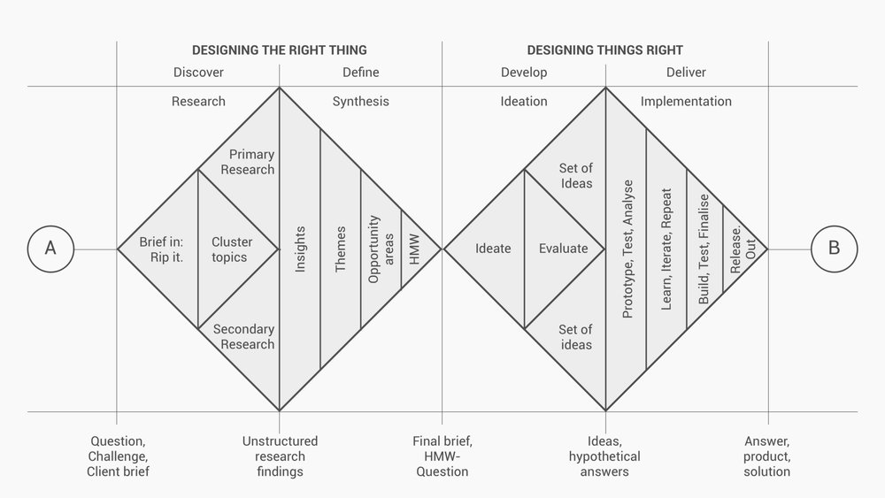

# Smart Office Design

## Background: Sick Building Syndrome
> **The goal of a building investigation is to identify and solve indoor air quality complaints in a way that prevents them from recurring and which avoids the creation of other problems. To achieve this goal, it is necessary for the investigator(s) to discover whether a complaint is actually related to indoor air quality, identify the cause of the complaint, and determine the most appropriate corrective actions.**

<!-- Complaint -> Investigate -> Act -> Evaluate -> Iterate
----------------- Human Centred --------------------- -->

<!-- ### Huidige Meetpunten -->

**Primaire objective meetpunten**
- [x] Temperatuur
- [x] Luchtvochtigheid
- [x] CO2
- [x] tVOC
- [ ] Geluid (noise)

**Secundaire objective meetpunten**
- [ ] Zit- en bewegingsdynamiek
- [ ] Licht(intensiteit)
- [ ] Stress (Heart Rate Variability)

**Primaire subjectieve meetpunten**
- [x] Perceived stress
- [x] Job-fit
- [x] Bevlogenheid

---

### Het probleem: Huidige Staat Employee Companion
> Healthy Workers heeft toegang tot kwalitatieve en kwantitatieve klimaat-data die omgeving-stressoren in kaart kunnen brengen. Momenteel wordt deze data weergegeven op interfaces in de web-app. Werknemers kunnen actuele waardes terugvinden in de Employee Companion, en de managers hebben toegang tot uitgebreide grafieken waarin klimaat-trends te zien zijn.

**Employee Companion:** De Employee Companion dient nu voor twee functies voor de werknemers, namelijk een klimaat-overzicht en het invullen van de wekelijkse vragenlijsten voor de vergaring van subjectieve informatie. Dit tweede punt is cruciaal voor de dienst die Healthy Workers levert. Ambassadeurs en managers hebben nog steeds moeite met alle werknemers zo ver krijgen om de vragenlijsten wekelijks in te vullen. Mijn theorie is dat dat komt door dat het een “low incentive, high effort, low pay-off”-product is.

- **Low Incentive:** de werknemers zijn zich niet bewust van hoe groot het belang is van het invullen van de vragenlijsten. In de werkelijkheid is het zo dat hun subjectieve input cruciaal is om te zien of mogelijke environmental pijnpunten daadwerkelijk relevant zijn en opgelost moeten worden, of dat niemand er echt last van heeft. Dat betekent dus dat de input die ze geven bij de vragenlijsten een soort “stempas” is binnen de democratie van hun werkomgeving.

- **High Effort:** De vragenlijsten vereisen veel tijd en concentratie van de gebruikers. Om de vragenlijsten in te vullen moeten ze hun werk stoppen, en dus onderbreekt dit de workflow van de gebruiker, bovendien is het (nog) niet mogelijk om de benodigde tijd te registreren in een programma als 10K.

- **Low Pay-off:** Zoals het er nu voor staat, krijgt de gebruiker inzichten op basis van de ingevulde vragenlijsten (met betrekking tot job fit, stress, engagement, etc.), bij elke vier-wekelijkse loop. Dat houdt in dat er telkens vier weken lang vragenlijsten ingevuld moeten worden, om een resultaat te zien. De gebruikers kunnen echter wel elk moment van de dag klimaat-informatie bekijken in de Employee Companion, of ze nou vragenlijsten hebben ingevuld of niet. Deze klimaat-informatie is echter niet erg relevant en wordt uitgedrukt in waarden die onduidelijk zijn voor de gebruikers.

### De oplossing: beknopte doelstelling
Een unobtrusive, embedded, smart-office bestaande uit modulaire, node-constructed, IoT apparaten om de ervaring van een werknemer in dit kantoor te optimaliseren.
- Een medium dat “onzichtbare” klimaat-waarden kan visualiseren in een format dat begrijpelijk is voor de gebruiker.
- Een interactie-dialoog tussen de occupant en de omgeving die begrijpelijk en transparant is.
- **De Employee Companion wordt vertaald van een web-app naar een officeOS.**

---

### Gesprek Karlijn
- [x] Onderzoek naar wensen gebruikers
- [ ] Inventarisatie van resources en mankracht (wie heb ik nodig van het team en waarom?)
- [ ] Presentatie: Eerste bevindingen onderzoek, korte kritiek op huidige EC, design challenge, voorbeelden (context & inspiratie), huidige informatie-verdeling Healthy Workers (waar vinden we wat, decentraal)
- [ ] Stephanie & Eline voor user research
- [x] Dinsdag 23 januari uitnodiging Sean voor meeting Karlijn

---

### Plan van aanpak: Double Diamond

| Sprint Titel              | Taak                  | Methoden                |
|:--------------------------|:----------------------|:------------------------|
| [Opzet](#opzet)           | Hoofd- & Deelvragen   |                         |
|                           | Design Challenge      |                         |
| [Onderzoek](#onderzoek)   | Desk Research         | Literatuur, Background  |
|                           | Vergaring User W&N    | Interviews, Survey      |
|                           | Inventarisatie W&N    | Value Proposition Canvas|
| [Conceptie](#conceptie)   | Brainstorm            | Co-Sessie               |
|                           | Scope & Definition    | Convergentie            |

</img>

---

### Opzet

### Design Challenge

> **Hoe kunnen we de fysieke werkomgeving optimaliseren door omgevings-stressoren inzichtelijk maken door middel van sensor-technologie?**

<!-- Tweede versie -->

> Hoe kunnen we het welzijn van kantoormedewerkers verbeteren, zonder de workflow te verstoren, door bewustzijn te creëeren over de omgevings-stressoren die

<!-- Derde versie -->

> Hoe kunnen we omgevings-stressoren inzichtelijk maken zonder de workflow van kantoormedewerkers te verstoren, door middel van een _systeem_ dat hun welzijn bevordert.

<!-- Sean's versie -->
> Hoe kunnen we op een unobtrusive manier het welzijn van kantoormedewerkers verbeteren, door bewustzijn te creëeren via inzicht in de omgevings-stressoren en de medewerkers

<!-- **Deelvragen** -->
**Hoe verhouden omgevings-stressoren zich tot welzijn?**
- Wat is welzijn? (twee krachten van werking)
- Hoe kunnen we welzijn meten en uitdrukken?
- Welke omgevings-stressoren vinden er plaats in een kantooromgeving?
- Hoe verhouden omgevings-stressoren zich tot ziekte(verzuim) en gezondheid?
- Hoe zwaar wegen deze factoren op tegenover de productiviteit?

**Welke methoden zijn bekend om deze stressoren te meten en uit te drukken?**
- Wat zijn de _best practices_ met betrekking tot data-vergaring?
- Hoe kan sensor-technologie voorzien van _deze_ inzichten?
- Welke sensor-technologiën gebruikt Healthy Workers al?
- Wat is de _best practice_ voor data-vergaring door middel van sensor-technologie in een kantoor-omgeving?

**Hoe kunnen we inzichten bieden in de meetpunten?**
- Hoe kunnen we een ruimte intelligent maken en welke factoren komen hier bij kijken?
- Hoe maken we de output inzichtelijk voor kantoor-medewerkers?
- Hoe ziet de _workflow_ van de kantoormedewerker in deze ruimte eruit?
- Wat is het belang van een interactief medium in een Smart Office
- Wat is benodigd voor een transparante feedback-loop tussen de kantoormedewerkers en de slimme kantooromgeving?

_Woordenlijst_
- ubiquitous / omni-present
- unobtrusive
- gesloten medium / open medium
- dialoog
- onbewuste / passieve input (tov actieve input)
- iteratief systeem: opstapeling van oplossingen (houdt bij elke oplossing alle voorgaande problemen in gedachten)
- Zero-measurement
- interventie-validatie

---

### Co-Sessie 19 januari

#### 1. Wat is een smart office?
Er werden verschillende definities genoemd. We waren het er in ieder geval over eens dat een "smart" office zich aanpast aan de context van de _occupants_ en hun wensen. Zo noemde Maarten (People Analytics Engineer) dat hij bijvoorbeeld een televisie "smart" vindt als de TV aan gaat wanneer hij de kamer binnenkomt en zijn favoriete serie aan zet. Ik reageerde hierop met: is de televisie aanzetten de grootste moeite (en dus het grootste probleem) dan? En waarom zou de televisie de favoriete serie van de gebruiker aanzetten? Ik ga er eigenlijk van uit dat de gebruiker zijn favoriete serie al vaak genoeg heeft gezien.

> De kunst is dat de televisie *weet* wat de gebruiker wilt kijken, zonder dat de gebruiker dit bewust heeft uitgesproken of heeft geïnitieerd.

De term "Smart Office" werd opnieuw gedefinieerd, dit keer stond "smart" voor het bemiddelen van de doelen van de gebruiker. En aangezien de doelen in een kantooromgeving rondom productiviteit, ontwikkeling en welzijn liggen, dienen deze doelen dus bemiddeld te worden door de omgeving.

> **Observeren, analyseren, reageren.**

Een _Smart Office_ observeert door middel van sensor-technologieën. Het luistert naar de _occupants_ en bestudeert de context. Op het moment dat er waarden worden geanalyseerd die bestempeld kunnen worden als _omgeving-stressor_, registreert de omgeving dit. Het slimme kantoor reageert door middel van een unobtrusive impuls aan de aanwezigen.

#### 2. Wat zijn de huidige struikelpunten van het EC klimaatoverzicht?
1. **Onduidelijkheid in de uitdrukking van waarden:** momenteel worden drie klimaat-waarden getoond in de Employee Companion, namelijk de luchtvochtigheid, temperatuur en luchtkwaliteit. De waarden waarin dit worden uitgedrukt (luchtkwaliteit: _alpenfris_), zijn onduidelijk voor de gebruikers.
2. **De klimaat-waarden zijn afhankelijk van timing:** De klimaatwaarden worden enkel real-time uitgedrukt. De gebruiker kan dus alleen de actuele waarden zien. Hoe verwachten we dat de gebruiker actie onderneemt als de gebruiker niet weet wanneer hij/zij actie moet ondernemen?
3. **Het is moeilijk verbanden te leggen tussen de verschillende klimaat-waarden:** Uit onze onderzoeken blijkt dat het vooral interessant is om te kijken naar de correlaties tussen verschillende waarden. Zo valt "Thermal Comfort" (gevoelstemperatuur) namelijk te berekenen door luchtvochtigheid en temperatuur met elkaar te vergelijken en kan "luchtkwaliteit" het beste geanalyseerd worden door de delta-waarden tussen tVOC en CO2-pieken te vergelijken.
4. **De Employee Companion verbreekt de workflow van de gebruiker te veel:** Om erachter te komen of er omgevings-stressoren plaatsvinden, moet de gebruiker zijn werk pauzeren, zijn mobiel pakken, browser openen, naar healthyworkers.nl gaan, inloggen met zijn/haar account en naar het klimaatoverzicht navigeren om inzichten te krijgen. Aangezien het systeem de werknemer dient, moet de technologie meer verweven zijn met de omgeving van de gebruiker.

#### 3. Het ideale officeOS
We hebben de volgende eisen vastgesteld waarmee we een kwalitatief-goed systeem onderscheiden van een minder goede variant:
- [ ] een OfficeOS is _ubiquitous_
- [ ] een OfficeOS is _unobtrusive_
- [ ] een OfficeOS is _transparant_
- [ ] een OfficeOS is _modulair_
- [ ] een OfficeOS biedt een _dialoog_
- [ ] een OfficeOS stelt _de occupant centraal_

---

### Gebruikersonderzoek Klimaat-inzichten

**Scenario:** Je werkt full-time in een kantooromgeving waar je geen ramen open kunt zetten, de verwarming centraal geregeld wordt en veel planten hebt staan. Er komt een bedrijf langs dat sensoren ophangt in elke ruimte. Ze zijn volledig transparant in hoe de technologie van de sensoren werkt. De sensoren zouden hypothetisch gezien alle natuurkundige en klimatologische omstandigheden kunnen meten.

*Aantal respondenten: 14 personen*

##### 1. Wat voor soort klimaatdata zou je graag willen laten meten en ontvangen?

Het valt me op dat de respondenten niet erg creatief durven te zijn met het bedenken van omgevings-sensoren. Populaire antwoorden waren: temperatuur, CO2, luchtvochtigheid en punten als "luchtvervuiling" en "zuurstofgehaltes", die onder Air Quality vallen.
Uniekere antwoorden waren: lichtintensiteit, lichtkleur, lichtverdeling, geluid en akoestiek, de klimatologische omstandigheden om een plant mee te verzorgen, het aantal mensen op een plek (reuring) en ergonomie (zithouding).

##### 2. Hoe zou je deze informatie uitgedrukt willen zien?

De informatie dient volgens bijna alle respondenten voornamelijk visueel te worden weergegeven. Sommigen geven aan grafieken te willen zien waarin waarden over tijd worden weergegeven met connotaties welke waarden goed en slecht zijn. Anderen geven aan dat ze graag "meters" of spectra willen zien, waarop wordt weergegeven wat de huidige waarde is op een horizontale as, en direct gerelativeerd kan worden met wenselijke en onwenselijke waarden.

##### 3. Waar zou je deze informatie willen terugzien? Op welke momenten zou je hier kijken?

De antwoorden op deze vraag vallen in vier categorieën te verdelen:

1. **Real-time omgeving naar device:** Informatie die door middel van een notificatie (real-time) naar de gebruiker wordt gestuurd. Deze respondenten vinden het een eng idee als ze zich in een ongezond klimaat bevinden en vinden het prettig om direct een melding te krijgen als ze iets kunnen doen om hun omgevings-stressoren af te zwakken en hun werkomgeving te optimaliseren. Deze notificatie moet zowel op desktop als mobile kunnen werken.
2. **Web-dashboard (passief):** Een web-dashboard waar gebruikers naar toe kunnen om grafieken te zien waarin klimaat-trends zichtbaar zijn. Hier ziet de gebruiker dan de huidige waarde, en of deze goed of slecht is, maar ook hoe deze waarden zich hebben ontwikkelt over de afgelopen tijdsperiode. Hiermee kunnen ze in één oogopslag zien of deze waarden vaker voorkomen of niet. De respondenten hebben aangegeven hier wekelijks of twee-wekelijks
3. **Centrale monitor:** Één scherm of een paar schermen (monitoren) in de kantooromgeving die als een dashboard fungeren. Als de gebruiker langs het scherm lopen kunnen ze in één oogopslag de huidige status van de werkomgeving zien.
4. **Decentrale nudge:** Op verschillende plekken in het kantoor specifieke bronnen kunnen raadplegen. Oftewel, bij elke afzonderlijke context een corresponderende output. De temperatuur-waarden zouden dan op andere plekken gezien kunnen worden dan de lichtintensiteit-waarden.

##### 4. Kun je mij een voorbeeld geven van informatie die je dagelijks bezoekt die visueel wordt weergegeven?

De meest voorkomende visuele informatie die de respondenten raadplegen zijn grafieken. Aangezien dit een antwoord was dat al te verwachten valt van kantoormedewerkers, vroeg ik door naar andere visuele media. Vervolgens gaven de respondenten aan dat ze elke ochtend het weerbericht bekijken in verschillende weer-applicaties. Een paar unieke antwoorden waren geografische kaarten en de tool van Google Photos die de gebruiker herinnert aan momenten die bijvoorbeeld een jaar geleden hebben plaatsgevonden.

##### 5. Vind je deze informatie-visualisatie duidelijk? En waarom?

Hieronder een rij met antwoorden die aangeven wat een visuele informatie-uitdrukking duidelijk en leesbaar maakt:

1. _"Short and to the point"_;
2. In één oogopslag kunnen zien of de huidige waarden "goed" of "slecht" zijn;
3. Een verwachtingspatroon over tijd, de mogelijkheid om te kunnen anticiperen en reageren;
4. Simpele iconen die ieder één functie hebben en dienen;
5. Informatie die aangeeft dat het context-specifiek is. Waarom ziet de gebruiker dit als uitkomst en welke factoren zijn daarvoor gebruikt om deze specifieke informatie aan de gebruiker te tonen?;
6. Overzichtelijk, direct de gewenste informatie kunnen zien;

##### 6. Heb je de behoefte om direct actie te ondernemen op het moment dat er "slechte" klimaatwaarden worden gemeten in de werkomgeving?

Alle respondenten hebben aangegeven dat ze direct actie zouden ondernemen op het moment dat ze vanuit hun omgeving feedback krijgen dat omgevings-stressoren significant zijn, of binnenkort zullen zijn. De acties die ondernomen zouden worden verschillen echter:

1. **Passief (via superior):** Een deel van de respondenten geeft aan actie te ondernemen door naar een manager of ander verantwoordelijk persoon te stappen om een melding of klacht door te geven. Ze hebben het idee dat ze zelf niet in staat zijn om het probleem aan te pakken. Sommigen denken wel de capaciteit te hebben om de stressor aan te pakken, maar vinden dat zij alsnog niet het aangewezen persoon zijn om deze actie te verrichten.
2. **Passief (verplaatsing):** Een ander deel van de respondenten heeft aangegeven om zich te verplaatsen van de plek waar een stressor plaatsvindt of zal plaatsvinden. De reden dat deze respondenten dat de meest logische keuze vinden, is omdat ze er erg in geloven dat veel stressoren subjectief zijn. Het is dan niet ondenkbaar dat het individu in kwestie als enige last heeft van deze stressor. De respondenten zeggen: "In plaats van de omgeving aanpassen, ook van toepassing op anderen, lijkt het me beter om zelf een omgeving met minder stressoren op te zoeken".
3. **Actief:** Eenderde van de ondervraagden geeft aan actie te ondernemen. Een deel hiervan geeft aan dat ze hierbij ook juist de sociale context interessant vinden. "Samen verantwoordelijk zijn voor een aangename werkomgeving" is een doel dat veel respondenten willen bewerkstelligen. Sommigen geven echter wel aan dat ze graag eerst willen overleggen met de rest van de medewerkers of de stressoren unaniem worden ervaren.

##### 7. Wat voor acties neem je op een werkdag om het binnenklimaat op je werkomgeving te optimaliseren?

Bij deze vraag vroeg ik de kantoormedewerkers welke acties ze verrichten op een gemiddelde werkdag om hun werkomgeving te optimaliseren. Bijna iedereen heeft aangegeven dat ze (zeer) regelmatig van werkplek veranderen.

> "Ik verplaats mezelf na elke afgeronde taak. Het is voor mij een manier om structuur te krijgen in mijn werkzaamheden. Ook merk ik dat ik me beter kan concentreren nadat ik me heb verplaatst." _- Respondent, werkzaam als grafisch vormgever._

Anderen hebben aangegeven ramen te openen, planten te plaatsen, deze planten water te geven, koffie of thee te drinken, regelmatig een rondje te lopen en lampen aan of uit zetten (afhankelijk van lichtensiteit op de werkplek).

<!-- ##### 8. Heb je het idee dat je productiever bent nadat je zo'n actie hebt ondernomen? Houd ook rekening met hoe lang het duurt om weer geconcentreerd te raken. -->

---

### Onderzoek

#### Hoe verhouden omgevings-stressoren zich tot welzijn?

##### 1. Wat is welzijn
In een onderzoek naar welzijn op de werkvloer wordt het volgende beschreven:

> Workplace wellbeing encompasses physical health and comfort, mental health, a preponderance of positive over negative affect, and positive attitudes towards work. ([The Routledge Companion to Wellbeing at Work](https://books.google.nl/books?hl=en&lr=&id=bi0lDwAAQBAJ&oi=fnd&pg=PA1&dq=wellbeing+workplace&ots=gZ9yZtXgcP&sig=mo2vPoem0eUXQBQlhpAH0xbo7dU#v=onepage&q=wellbeing%20workplace&f=false))

</img>

Het bovenstaande model wordt als fundament gebruikt voor de wetenschap waar Healthy Workers haar product op rust.

De objecten in de illustratie worden "_constructen_" genoemd. En de relatie tussen deze constructen is enigszins vergelijkbaar als die van de lagen in de Maslow piramide. Het enige verschil is dat deze constructen meer dynamisch gerelateerd zijn aan elkaar. Het is dus niet per se zo dat pas als de werk-omgeving optimaal is, er gewerkt kan worden aan de construct "stressors". Ze kunnen namelijk allemaal afhankelijk gemanipuleerd worden en de effecten hiervan zullen te merken zijn bij elk ander construct.

**Werk-omgeving:** Allereerst is te zien dat in de werk-omgeving voornamelijk bestudeert wordt hoe het klimaat gesteld is. De vraag luidt voornamelijk: is het een omgeving waar in concentratie gewerkt kan worden zonder dat dit wordt verstoord door klimaat-factoren? Hier wordt eigenlijk al het belang van het monitoren van klimaat-factoren verduidelijkt. De andere factoren die de psychologische kwaliteit van de werk-omgeving bepalen zijn de relaties tussen werknemers en werkgevers en de steun die beiden partijen ontvangen en bieden en een gevoel van veiligheid (zowel financieel als fysiek).

**Stressoren:** Het tweede construct staat voor de stressoren. Deze wordt verdeeld in drie typen stressoren: fysieke, sociale en impliciete stressoren.

> Een stressor is een impuls dat stress veroorzaakt in ons brein. Stress is de psychologische reactie op fysieke, mentale of emotionele stimuli die het lichaam voorbereiden op uitdagende situaties.

Fysieke stressoren zijn deels objectief en deels subjectief. Een fysieke stressor zou geluid(overlast) kunnen zijn. Bijna iedereen zal het vervelend vinden om een hoge, luide, consistente toon te horen in de werkomgeving, maar de exacte decibel-grens waarop het geluid verandert in "overlast" verschilt per persoon. Het brein is dan bezig met het verwerken van de impulsen die vanuit de zintuigen worden aangeleverd. Sociale en impliciete stressoren zijn moeilijker te meten en uit te drukken. Sociale stressoren hebben te maken met de onderlinge relaties tussen mensen, impliciete stressoren hebben te maken met de _cultuur_ waar de mensen onderdeel van zijn.

> Het verschil tussen sociale en impliciete factoren is uit te leggen met gebruik van de volgende analogie: Sta jij in je pauze in je eentje buiten, of samen met je collega's (sociaal), en roken jullie een sigaret of eten jullie een appel (impliciet)? ([Meme Veels, People Analytics Researcher](https://healthyworkers.nl/))

**Well-being:** Als vorige twee constructen in onbalans zijn en er daardoor onvoldoende fundament is voor een mentaal- of fysiek gezonde werkomgeving, kan dit resulteren in de toename van burnouts, workaholism en de afzwakking van engagement (bevlogenheid).

##### 2. Hoe kunnen we welzijn meten en uitdrukken?
Welzijn is puur subjectief. Dat betekent dat om welzijn te kunnen meten, de persoonlijke input van het individu noodzakelijk is. Momenteel maakt Healthy Workers gebruik van wekelijkse vragenlijsten die aan de hand van wetenschappelijk-geteste psychologische modellen pijlen wat de staat van welzijn is. Deze vragen hebben voornamelijk te maken met de constructen die in de vorige deelvraag werden toegelicht.

| Construct                      | Onderwerp                   |
|:-------------------------------|:----------------------------|
| Fysieke factoren               | Waargenomen binnenklimaat   |
|                                | Omgevings-stressoren        |
| Sociale factoren               | Sociale uitwisseling        |
|                                | LMX (leader-member exchange)|
|                                | Gerechtigheid               |
| Welzijn                        | Bevlogenheid                |
| Werk-Prestatie                 | Focus & Concentratie        |
|                                | Waargenomen werkdruk        |
|                                | Gevoel van steun            |
|                                | Job-fit                     |
|                                | Betrokkenheid               |
|                                | Burnout                     |
|                                | Cohesie                     |
|                                | Feedback                    |
|                                | Workaholism                 |

##### 3. Welke omgevings-stressoren vinden er plaats in een kantooromgeving?
De term "omgevings-stressor" kan breed getrokken worden. Het omvat alle impulsen die in een (werk)omgeving aan bod komen die stress veroorzaken. In dit onderzoek beschrijf ik alleen de stressoren die universeel van toepassing zijn in een kantooromgeving, daadwerkelijk een stressor vormen en uiteindelijk ook een significante invloed hebben op factoren als stress, ziekteverzuim, gezondheid en productiviteit.

Allereerst is het belangrijk om te adresseren dat bij toename aan de hoeveelheid stressoren in een werkomgeving, de productiviteit exponentieel daalt. In het onderstaande figuur zie je wat de invloed is van meerdere stressoren die tegelijkertijd plaatsvinden, opgezet tegen de invloed die dat heeft op de productiviteit van een kantoormedewerker.

</img>

In dit figuur wordt op de verticale as "Work Performance" uigedrukt in een cijfer (0 - 10). Zoals te zien is heeft dit onderzoek aangegeven dat de productiviteit een 6 krijgt op het moment dat er geen enkele storende factor plaatsvindt op de werkvloer. Zodra er één stressor werd geactiveerd, daalde de productiviteit naar 5.8 (afname van 0.2 pt), bij twee stressoren naar 5.6 (voortzetting afname van 0.2 pt) en bij drie stressoren naar 5.1 (afname stijgt naar 0.5 pt).

###### (Gevoels)Temperatuur
Temperatuur, uitgedrukt in graden celsius, is de hoeveelheid en intensiteit aan warmte (of hitte) aanwezig in een substantie of object. Met gebruik van temperatuur-sensoren kunnen verschillende klimatologische eigenschappen van een binnen-omgeving gemonitord worden. Temperatuur is een stressor die erg nauw luistert en gevoelig is voor subjectiviteit. Zo is het verschil tussen 22 en 23 graden celsius niet direct te merken. En vind het ene persoon 22 graden een aangename temperatuur, waar iemand anders 20 graden al warm vind.

We weten echter wel dat er temperaturen zijn die in de wetenschap hebben gebleken tot condities die bevorderend zijn voor productiviteit. Uit experimenten is gebleken dat bij 22 graden celsius de hoogste productiviteit wordt behaald.

###### Luchtkwaliteit
x

###### Licht(intensiteit)
Licht reist op het elektromagnetische spectrum en bestaat uit een spectrum tussen radio- en gamma stralen. De elektromagnetische krachten transporteren energie van de ene plek naar de andere.

Als het op licht aan komt zijn er drie natuurkundige factoren die van belang zijn, namelijk de lichtfrequentie, de lichtintensiteit en de lichtkleur.

Licht kan uitgedrukt worden in frequenties (Hz) wat impliceert wat de "constantheid" van het licht-signaal is. Een lampje knippert in feiten zo snel, dat het menselijk oog dit signaal percipieert als een constant signaal, waardoor we waarnemen dat het licht aan is. Het menselijk oog kan tot aan relatief lage frequenties waarnemen, maar het menselijk brein kan wel tot aan 1000 Hz signalen registreren. Dit is "informatie" die we niet kunnen zien, maar wel verwerkt worden. Natuurlijk daglicht kent een frequentie van 126.66 Hz, hier is het menselijk brein ook op gebouwd door de evolutie heen. Inmiddels omgeven kantoormedewerkers zich veel in de buurt van kunstmatige lichtbronnen, zoals TL-verlichting. De meeste TL-lampen hebben een 2 KHz frequentie. Voor ons oog maakt dit weinig verschil, maar ons brein neemt hierdoor veel meer informatie op. Dit veroorzaakt stress. Dit geldt niet alleen als je rechtstreeks in de lamp kijkt, maar ook als je aan een bureau werkt en de TL-lamp verlicht dit werk-oppervlak.

Een tweede belangrijke factor van licht is lichtkleur. Een lichtstraal bestaat uit een spectrum van verschillende kleuren. We kennen dit onder anderen van de album cover van Pink Floyd en het fenomeen van de regenboog. Ook lichtkleur is van gigantische invloed op de mentale gezondheid van de mens. Lichtkleur en het kleurverloop over tijd heeft een directe relatie met ons melatonine-huishouden. De biologische klok van de mens is gebaseerd op dag- en nachtritmes, en daarmee dus op het verloop van lichtkleur over de dag. In natuurlijk daglicht de ochtend zijn de gele tinten dominant, in de middag een verloop van witte naar blauwe tinten, en in de namiddag oranje en rode tinten. In de winter ontvangen we minder licht, en bestaat het daglicht dat we ontvangen voornamelijk uit blauwe tinten. Dit is ook waarom ons melatonine-huishouden vooral in de winters uit balans zijn. Volgens veel wetenschappers heeft dit fenomeen een directe relatie met winter-depressies. Ook hier geldt dat TL-verlichting geen natuurlijk, maar kunstmatig kleuren-spectrum gebruikt dat interfereert met de kleuren die het menselijk lichaam nodig heeft.

De derde factor van licht is lichtintensiteit. Voor elke denkbare context bestaat er een ideale lichtintensiteit. lichtintensiteit wordt uitgedrukt in lumen, en de hoeveelheid licht dat op een oppervlakte valt wordt uitgedrukt in lux. Omdat lux een stuk praktischer is, wordt deze ook in de technologie als maatstaaf gehanteerd om de hoeveelheid licht te meten.

</img>

Omdat het menselijk oog een signaal bestaande uit licht-impulsen naar ons brein stuurt. Kun je stellen dat bij een zicht waarbij de lichtintensiteit te hoog is, er te veel informatie naar het brein wordt gestuurd. Dit is waarom wij een schemerige omgeving vaak connoteren aan een comfortabele ruimte en een felle ruimte met veel knipperende color-LEDS irritant vinden. Voor computer-gerelateerd werk, zoals in kantooromgevingen vaak het geval is, wordt aangeraden om een constante 500 lux te hanteren.

###### Ergonomie
De grootste dreiging met betrekking tot ergonomie is de Muskoskeletal Disorder (MSD). Dit letsel is verantwoordelijk voor bijna 30% van alle zakelijke compensatie-kosten. De oorzaken met betrekking tot deze MSD's zijn voornamelijk slecht afgestelde bureaus waarbij het middenpunt van het beeldscherm niet op ooghoogte zit van de gebruiker, een stoel waarvan de rugleuning of zithoogte niet goed is afgesteld op de bouw van de gebruiker en de plaatsing van de schouders, polsen en handen van de gebruiker ten opzichten van het romp. Dit laatste punt is vaak het geval bij gebruik van laptops zonder externe toetsenborden of muizen.

Er zijn voorschriften voor hoe het beste gezeten kan worden in een kantooromgeving. Maar deze standaarden worden steeds meer achterhaald. Hedendaags is de slogan: "Ergonomisch zitten is goed, dynamisch zitten is beter". Met andere woorden: verander vaak van zit-positie, bevorder de bloedcirculatie voldoende en streef naar consistente zit-sta ritmes.

###### Geluid
Geluid is een trilling (oscillatie) dat reist door een medium bestaande uit een vaste stof, vloeibare stof of gas. Het meest bekende medium waar geluidsgolven over reizen is zuurstof (lucht). De lucht heeft eigenschappen die ervoor zorgen dat bij een temperatuur van 18 graden celsius, de geluidstrillingen kunnen reizen met een snelheid van 340 meter per seconde. Zodra de temperatuur toeneemt, neemt ook de bewegingssnelheid van de lucht-moleculen toe, waardoor het medium een betere geleider wordt voor de geluidstrillingen. Dit resulteert in een hogere snelheid van geluidsgolven.

> Bij geluid speelt er altijd een samenspel tussen de verzender, het medium en de ontvanger. Een voorbeeld: een speaker verzendt een geluidsgolf, de golven worden geleid door lucht, en komen aan bij een menselijk oor waar de trillingen worden vertaald naar impulsen die waargenomen worden als geluid.

Het hoofd van een volwassen persoon is ongeveer 16 cm breed. De afstand tussen de twee oren is gemiddeld 15 cm. Op het moment dat er een zijwaartse geluidstrilling naar een persoon wordt gestuurd, zal het oor dat dichterbij de verzender is, het signaal zo'n 2 ms eerder ontvangen. Het menselijk brein kan door deze interval, ook wel _interaural time difference (ITD)_, interpreteren waar het geluid vandaan komt. Dit fenomeen wordt in de technologie ook wel geluidslocalisatie genoemd.

In een kantooromgeving kan geluid zeer makkelijk een stressor worden. Dit kan komen doordat het geluid te hard is (amplitude), de toonhoogte irritant is (frequentie) of omdat het signaal lang duurt en zich (in)consistent voortzet (signaal-lengte). Amplitude staat ook wel voor volume en wordt uitgedrukt in decibel (dB). Frequentie staat voor toonhoogte en wordt uitgedrukt in Herz (Hz).

Het menselijk gehoor kan beschadigen door onwenselijke amplitudes. Het ideale volume voor een kantooromgeving om productiviteit en concentratie te bevorderen is vastgesteld op 45 decibel. Het is niet direct schadelijk als het gehoor wordt blootgesteld aan een korte geluidstrilling van 100 decibel. Zoals in veel gevallen, zit het gevaar in de tijdsduur van blootstelling, gepaard met intensiteit van het signaal.

In het onderstaande figuur is te zien hoe lang een mens blootgesteld kan worden aan een bepaald volume voordat het gehoorschade oplevert.

</img>

Zodra geluid een stressor vormt in een kantooromgeving kunnen Problemen met betrekking tot geluidsamplitude kan op drie punten aangepakt worden. Allereerst kan gekeken worden bij de geluidsbron. Hier wordt het volume geminimaliseerd. Vervolgens kan gekeken worden naar het geluidsmedium (of -pad), hier kan namelijk akoestiek een factor spelen. Tot slot kan de geluidsontvanger ook signalen "blokkeren" door bijvoorbeeld een koptelefoon te dragen. Een manier om de akoestiek te veranderen van het geluidsmedium, is door middel van geluidsabsorptie. Hier zijn verschillende middelen voor, waaronder geluidsabsorberende planten zoals mossen.

##### 4. Hoe verhouden omgevings-stressoren zich tot ziekte(verzuim) en gezondheid?
x
