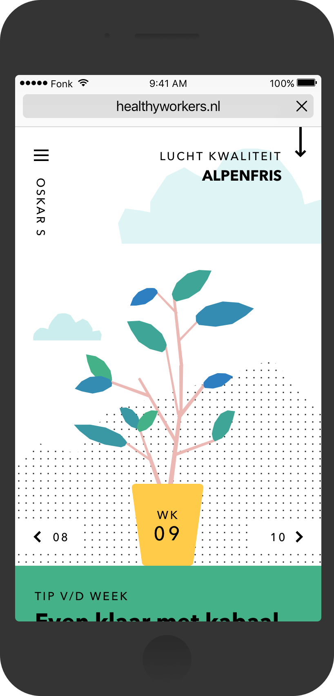
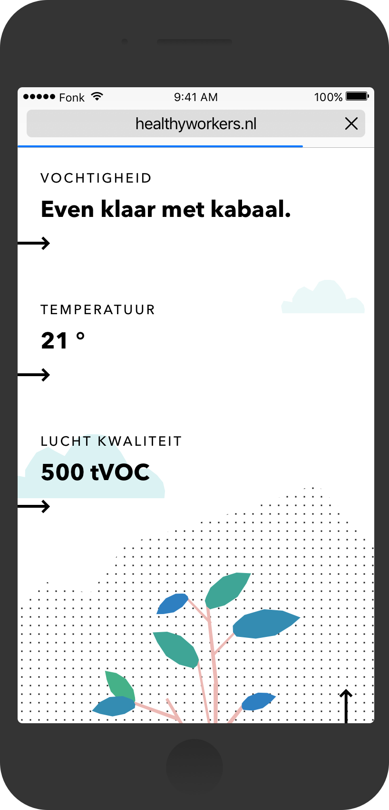

# Onderzoek Afstudeerproject
Door Daan Rongen, afstudeerstudent major Technology Design, minor Intelligent Environments, focus op design-ethiek, UX design en media-filosofie.

## Introductie
In dit afstudeerverslag beschrijf ik de urgentie van het probleem dat ik wil oplossen met mijn afstudeerproject aan de studie _Communication &amp; Multimedia Design_ aan de Hogeschool van Amsterdam in opdracht van HR-tech startup Healthy Workers. De ontwerpvraag die ik hiervoor heb geformuleerd is als volgt:

> **Hoe kun je stressoren in de fysieke werkomgeving inzichtelijk maken voor kantoormedewerkers die full-time bij een corporate bedrijf werken, door middel van een web-app die verbonden is met een IoT-device, om het comfort van de werkplek te optimaliseren zodat stress afzwakt.**

Om het theoretische kader van het onderzoek te concretiseren naar een praktische toepassing, heb ik de volgende design challenges geformuleerd:

- [ ] Hoe kun je omgevingsfactoren inzichtelijk maken door middel van digitale technologie zodat deze informatie systematisch gebruikt kan worden?
- [ ] Hoe kun je connotaties toekennen aan omgevingsfactoren, zodat het gewicht van een potentiële stressor uitgedrukt kan worden?
- [ ] Hoe kun je omgevingsstressoren inzichtelijk maken en gelijkertijd respecteren dat kantoormedewerkers verschillende standaarden van comfort hebben?
- [ ] Hoe kun je inzicht bieden in stressoren, zodat kantoormedewerkers het comfort van hun werkomgeving kunnen optimaliseren?
- [ ] Hoe kun je kantoormedewerkers van inzichten over hun werkomgeving voorzien, zodat ze een actie kunnen ondernemen die zowel in het belang van het individu als van het collectief is?
- [ ] Hoe kun je middels een (externe) technologie kantoormedewerkers helpen het comfort van hun werkomgeving te optimaliseren, waarbij alsnog de workflow die bij een full-time kantoorbaan hoort gerespecteerd wordt?

## Inhoud

* [1. Inleiding](#inleiding)
* [2. Opdrachtgever](#opdrachtgever)
  * [2.1 Huidige Product](#huidige-product)
  * [2.2 Toekomstvisie](#toekomstvisie)
* [3. Literatuuronderzoek](#literatuuronderzoek)
  * [3.1 Licht](#licht)
    * [3.1.1 Lichtkleur](#lichtkleur)
    * [3.1.2 Lichtintensiteit](#lichtintensiteit)
  * [3.2 Geluid](#geluid)
  * [3.3 Klimaat](#klimaat)
    * [3.3.1 Thermisch Comfort](#thermisch-comfort)
    * [3.3.2 Luchtkwaliteit](#luchtkwaliteit)
  * [3.4 Ergonomie](#ergonomie)
  * [3.5 Fysieke Omgevings-stressoren](#fysieke-omgevings-stressoren)
* [4. Bevindingen Veldonderzoek](#bevindingen-veldonderzoek)
  * [4.1 Sensordata Werkomgeving](#sensordata-werkomgeving)
  * [4.2 Het Aflezen van Informatie](#het-aflezen-van-informatie)
  * [4.3 Actie Ondernemen](#actie-ondernemen)

## Inleiding
In Nederland werken ruim 2.3 miljoen mensen in een kantooromgeving (Dhr Stijnenbosch, M. H. 2015, [Ontwikkelingen op de Kantorenmarkt in Nederland](https://www.google.nl/url?sa=t&rct=j&q=&esrc=s&source=web&cd=2&ved=0ahUKEwi4g_uY8IzaAhWjMewKHXhPAaIQFgguMAE&url=https%3A%2F%2Fwww.nvm.nl%2F-%2Fmedia%2Ffiles%2Fnvmopenbaar%2Fmarktinformatie%2Fbusiness%2Fkantoren-in-cijfers-2015.pdf&usg=AOvVaw1F0l3c7wuodttkmsOWBN7J)). Dat is bijna eenderde van de complete beroepsbevolking van Nederland (CBS, 13-02-2015, [Beroepsbevolking Nederland](https://www.cbs.nl/nl-nl/achtergrond/2017/06/bevolking-15-tot-75-jaar)). Alhoewel het ziekteverzuim van de gemiddelde Nederlandse kantoormedewerker lager ligt dan bij andere sectoren, is het alsnog niet de meest gezonde werkomgeving om langdurig in te werken. Dit heeft te maken met de hoeveelheid stressoren die veroorzaakt worden in de werkomgeving. Stressoren zijn impulsen waarbij het vrijkomen van het stresshormoon wordt bevorderd (Ontstressen.net, n.d. [Wat zijn stressoren?](https://ontstressen.net/wat-zijn-stressoren/)). Deze impulsen kunnen onderverdeeld worden in fysiologische stressoren, zoals kou, pijn en lawaai, en psychologische stressoren zoals nare herinneringen of slechte relaties met mensen om ons heen. Het is dan ook niet gek dat sinds het begin van de eenentwintigste eeuw de leus _"stress op het werk is beroepsziekte nummer één"_ steeds bekender is geworden. Meer dan een miljoen Nederlandse kantoormedewerkers kampt met burn-out klachten en 36% van al het werk-gerelateerde ziekteverzuim wordt veroorzaakt door stress. Van al deze medewerkers die kampen met stress, vormt de groep jonge medewerkers (leeftijd 25 tot 35 jaar) de grootste groep (TNO, n.d. [Factsheet Werkstress](http://www.monitorarbeid.tno.nl/publicaties/factsheet-werkstress)). Buiten het feit dat het een grote kostenpost is voor bedrijven en dat het bijzonder vervelend is voor de medewerkers op het werk, kan stress van het werken ook nog langdurige effecten met zich meebrengen die later in, of zelfs na het beroepsleven, consequenties hebben op de gezondheid van de kantoormedewerker.

Er zijn in de afgelopen decennia veel onderzoeken geweest naar welzijn van werknemers in een kantooromgeving. De eerdergenoemde fysiologische stressoren worden voornamelijk veroorzaakt door factoren die te maken hebben de fysieke werkomgeving. In dit onderzoeksrapport behandel ik de voornaamste fysieke stressoren in de kantooromgeving: licht, geluid, klimaat en ergonomie.

## Opdrachtgever

Healthy Workers zet zich in om werknemerswelzijn te meten en te verbeteren bij grote corporates. Naast het management bestaat het team uit developers, designers, researchers en psychologen. Healthy Workers is nog jong, maar er zit veel momentum en groei in de start-up. De start-up heeft een partnership met startup-hub [B. Building Business](http://b-buildingbusiness.com/amsterdam/) en vastgoed-bedrijf [CBRE](https://www.cbre.nl/en) en is co-founded door digital design agency [FONK](http://fonk.amsterdam/). Door sensoren in kantoorruimtes te hangen verricht Healthy Workers objectieve metingen over de fysieke werkomgeving. Denk hierbij aan metingen over de binnentemperatuur, luchtkwaliteit en geluidsniveaus. Ook heeft Healthy Workers een web-app ontwikkelt die middels vragenlijsten subjectieve input van elke kantoormedewerker vraagt over hoe zij de werkomgeving ervaren. Denk hierbij aan vragen over hun relaties met collega's, of ze hun persoonlijke leerdoelen behalen en of ze zich op hun plek voelen bij het bedrijf. Healthy Workers noemt zichzelf een bedrijfs-_'thermometer'_. Ze verrichten metingen, analyseren de resultaten, delen de inzichten met het management en doen suggesties voor hoe de werkomgeving verbeterd kan worden waardoor het werknemers-welzijn zal stijgen. Ook is Healthy Workers vervolgens gekoppeld met interventie-partijen die deze verbeteringen kunnen implementeren. De interventies worden gevalideerd op haar rendabiliteit. Dit proces wordt herhaald totdat het bedrijf 'gezond' is. De voornaamste doelen van Healthy Workers zijn het laten stijgen van bevlogenheid en productiviteit van werknemers, bedrijven aantrekkelijk maken voor talenten en deze ook binnen houden en het verminderen van ziekteverzuim en gezondheidsklachten.

### Huidige product

Lees over het huidige product

   
  

  

    </img>
    </img>
  

  <h4>Employee Companion</h4>
  Hierboven zijn twee schermen te zien van de web-app van Healthy Workers. Deze web-app, speciaal voor de werknemers, wordt de **Employee Companion** genoemd. In het linkerscherm zie je de home-page van de huidige web-app. De plant symboliseert persoonlijke groei. Het getal op de pot geeft aan hoe veel weken de gebruiker de web-app gebruikt. Bovenin het linkerscherm is te zien dat de luchtkwaliteit *'alpenfris'* is. Als hierop wordt geklikt, gaat de gebruiker naar het rechterscherm, het *klimaatoverzicht*. Hier zien de kantoormedewerkers alle informatie die real-time van de geplaatste sensoren komt.
   
  <h4>Questionnaire</h4>
  De Employee Companion heeft nog een andere functie, die eigenlijk nog belangrijker is. Elke week staat er een nieuwe vragenlijst ('questionnaire') klaar voor de kantoormedewerkers. Deze vragenlijsten worden zorgvuldig samengesteld door de psychologen die bij Healthy Workers werken. Een vragenlijst bevat gemiddeld zo'n 40 vragen, die vaak erg verschillend zijn maar wel nog binnen een wekelijks thema vallen. In week één zou het thema rondom collegialiteit kunnen liggen, en in de volgende week over persoonlijke leerdoelen.
   
  <h4>Het probleem</h4>
  De vragenlijsten worden onvoldoende ingevuld. Het is heel belangrijk dat deze vragenlijsten worden ingevuld, want dit is de enige manier waarop Healthy Workers subjectieve informatie verzamelt. Zonder deze input, kunnen ze geen analyse doen en geen interventie-strategie opstellen ter verbetering van het bedrijf. Healthy Workers heeft in het afgelopen halfjaar drie pilots bij corporate bedrijven uitgevoerd. Deze vonden plaats bij Uitvoeringsinstituut Werknemersverzekeringen (UWV), een van de grootste accounting-firma’s PricewaterhouseCoopers (PWC) en bloemen- conglomeraat Royal FloraHolland. Uit deze pilots bleek dat er vier voornamelijke redenen waren voor de kantoormedewerkers om de vragenlijsten niet in te vullen: te weinig tijd, de vragenlijsten waren te lang, de kantoormedewerkers zagen het nut niet van de vragenlijsten niet in en ze zagen niet in wat de vragen met hun werkomgeving te maken had.
  <h4>Hypothese</h4>
  Zelf heb ik ook een hypothese opgesteld op basis van [B. J. Fogg's Behaviour Model](http://www.growthengineering.co.uk/bj-foggs-behavior-model/). Fogg stelt namelijk dat al het gedrag een uitkomst is van de relatie tussen de motivatie om het gewenste gedrag uit te voeren en het vermogen om dit te bewerkstelligen. In dit scenario is het gewenste gedrag dat kantoormedewerkers (op tijd) de vragenlijsten invullen. Kantoormedewerkers werken full-time bij een bedrijf waar ze worden geacht om veel te werken. Het vermogen om wekelijks 40 complexe vragen in te vullen tijdens werktijd is al relatief laag. Ook er vanuitgaande dat Healthy Workers bewust deze bedrijven heeft benaderd omdat hier het werknemerswelzijn verbeterd kan worden impliceert al dat het concentratie-vermogen, productiviteitsgehalte, en stress- en engagement-niveau niet optimaal zijn, maar dat terzijde. De motivatie om alsnog de vragenlijsten in te vullen moet dus relatief hoog zijn om het gewenste gedrag te doen slagen. Het tegendeel is waar, de motivatie is juist laag omdat de kantoormedewerkers niet inzien waarom ze moeite en tijd moeten steken in het invullen van de vragenlijsten. Je zou nog kunnen zeggen dat juist de rest van de functies in de Employee Companion de motivator is, zoals het real-time klimaatoverzicht, maar deze is bewezen niet duidelijk te zijn voor de gebruikers. Zo begrijpen ze de uitrdrukkingen van sensor-waarden niet en vinden ze de metingen die worden uitgedrukt niet relevant voor hun werkomgeving.
  

### Toekomstvisie

Lees hier over de toekomstvisie

   
  

  In de komende jaren wilt Healthy Workers vooral veel groeien.
  

## Literatuuronderzoek

De onderzoeksvragen die ik geforumuleerd heb op basis van de ontwerpvraag zijn als volgt:
* Wat maken omgevingsfactoren in de kantooromgeving tot stressoren?
* Wat zijn de voornaamste omgevingsstressoren in een kantooromgeving?
* Wat zijn de invloeden van deze stressoren op het welzijn van de
kantoormedewerker?
* In hoeverre kunnen stressoren individueel verschillen per medewerker?

### Licht

Lees over lichtkleur

  

  <h4>Lichtkleur</h4>
  Licht bestaat uit een kleurenspectrum en elke lichtkleur in dit spectrum wordt uitgedrukt in K (kelvin). Het iconische kleurenspectrum kennen we van de regenboog en de album cover van _Pink Floyd's Dark Side of the Moon_. De menselijke biologische klok is zodanig geëvolueerd dat we een bepaalde afhankelijkheid hebben opgebouwd naar deze kleuren in het lichtspectrum. Onze klok is zo ingesteld dat de mens in de ochtend kleurtemperaturen van 2700K prefereren, dit zijn voornamelijk rode en oranje kleurtinten. Aan het einde van de ochtend is het van belang om een mens bloot te stellen aan witte en blauwe kleurtinten vanaf 4000K en naarmate de middag begint de kleurtinten richting de 6500K te laten veranderen. Dit resulteert in een toename van alertheid en het behoud van concentratie. Richting het einde van de middag zijn gele en oranje kleurtinten wenselijk, deze bevorderen prestatie. Aan het einde van een dag, voordat het donker wordt, heeft de mens weer behoefte aan rode lichtkleuren om tot ontspanning te kunnen komen. Deze lichtkeuren en de tijdstippen waarop de lichtkleuren veranderen zitten van nature in daglicht, dat is logisch. Maar deze lichtkleuren komen niet naar voren in de meeste kunstmatige lichtbronnen in kantooromgevingen, zoals TL-verlichting. Het nastreven van deze lichtkleur-ritmes is niet alleen bevorderend voor de concentratie, alertheid, productiviteit en energie. Het negeren van de behoefte aan deze ritmes, en dus hele dagen lang blootgesteld worden aan een non-dynamische lichtbron, brengt het melatonine-huishouden van de mens uit balans. Een van de bekendste symptomen van een verstoorde melatonine-huishouding is depressie. Voor veel wetenschappers is dit ook de verklaring van het fenomeen "winterdepressie".
  

 

Lees over lichtintensiteit

  

  <h4>Lichtintensiteit</h4>
  Licht reist op het elektromagnetisch spectrum en bestaat uit knipperingen. De frequentie (Hz) waarop dit licht knippert bepaald de constantheid van het signaal. De hoeveelheid licht die door de ruimte heen reist wordt echter uitgedrukt in lumen. Maar aangezien we bij een kantooromgeving specifiek willen weten in hoeverre het werkoppervlakte van de kantoormedewerker voldoende wordt belicht, gebruiken we lux als eenheid. Een lux staat gelijk aan één lumen per vierkante meter en beschrijft de hoeveelheid licht dat op een oppervlakte schijnt. Het is in Nederland vastgelegd in de Arbeidsomstandighedenwet onder de norm "lux-waarden" dat een kantooromgeving minimaal 500 lux moet bieden op de werkplek. Dit geldt ook voor vergaderruimtes. In gangen, archief-ruimtes en kantines mag de lux-waarde echter 150 zijn (Lumeco Light Solutions, n.d. [Luxwaarden voor verschillende toepassingen](https://lumeco.nl/lux-en-lumen/)). Te weinig verlichting betekent dat er minder visuele informatie vanuit het oog naar het brein gestuurd kan worden, en dat er meer inspanning geleverd moet worden voor een taak. Bij te veel licht kan het oog juist informatie uit het complete zichtveld halen, wat een _information overload_ kan zijn. Beide gevallen dragen bij aan de ontwikkeling van stress. Tot slot is de relatie tussen voor- en achtergrond belangrijk. Het focusveld, daar waar de kantoormedewerker visuele informatie uit wilt halen, dient voldoende verlicht te zijn, terwijl alles daaromheen voor zo min mogelijk visuele afleiding moet zorgen.
  

### Geluid

Lees over geluid

   
  

  Geluid is de oscillatie van druk dat wordt overgedragen door een 'medium'. Dit medium kan een vaste, vloeibare of gasvorm hebben. Het bekendste medium waar deze trillingen doorheen reizen is zuurstof in gasvorm. Geluid heeft altijd een verzender, medium en ontvanger. In een scenario waar een kantoormedewerker geconcentreerd zit te werken, en er een collega muziek wilt luisteren is de speaker de verzender, zuurstof het medium en het oor van de medewerker de ontvanger. Afhankelijk van het volume dat de speaker uitzendt, de afstand tussen de verzender en de ontvanger, de hoeveelheid geluidsabsorptie die in de ruimte plaatsvindt en eventuele gehoorbescherming die de ontvanger draagt, wordt de concentratie van de medewerker wel of niet doorbroken. Geluid is een van de grootste stoorzenders in een kantooromgeving. Het meest wenselijke geluidsniveau is echter een punt waar veel medewerkers van mening verschillen. Het is echter wel gebleken dat "ergernis" door geluid de meest significante afname in werk-productiviteit draagt. Op het moment dat er sprake is van ergernis door geluid, spreekt men al snel van "noise pollution". Dit is het resultaat van een slechte verhouding tussen verzender, medium en ontvanger in het omgevingsgeluid. Noise pollution op kantoren zorgt voor een flinke afname in productiviteit, zwakkere learning curves, moeite van het opnemen van nieuwe informatie, moeite met het ophalen van herinneringen en het afbreken van concentratie. Geluid wordt uitgedrukt in decibel (dB), maar er is een gestandaardiseerd equivalent voor het menselijk oor en dat is dBA. Het geadviseerde geluidsniveau voor in kantoren, gebaseerd op optimale productiviteit en concentratie, is 45 dBA. Het gemiddelde geluidsniveau in kantoren in Nederland is echter 54 dBA.
  

### Klimaat

Less over klimaat (algemeen)

  

  <h4>Klimaat</h4>
  Onder klimaat in de kantooromgeving beschouw ik binnentemperatuur (°C), luchtvochtigheid (%), de hoeveelheid CO₂-luchtdeeltjes in de lucht in verlijking tot een miljoen luchtdeeltjes (ppm) en de hoeveelheid tVOC, vluchtige organische componenten, in vergelijking tot een miljard luchtdeeltjes (ppb). Deze vier onderwerpen kunnen gecategoriseerd worden onder thermisch comfort en luchtkwaliteit.
  

 

Lees over thermisch comfort

  

  <h4>Thermisch Comfort</h4>
  Temperatuur is natuurkundig-gezien de hoeveelheid warmte aanwezig in de substantie van een chemisch element. Een decennium geleden hebben er wetenschappelijke onderzoeken  geconcludeerd dat bij een temperatuur van 22 °C optimale productiviteit behaald kan worden (Helsinki Univeristy of Technology, 2006, [The Optimal Office Temperature](https://www.pgi.com/blog/2016/05/the-optimal-office-temperature-for-workplace-productivity/)). Inmiddels zijn wetenschappers zich er van bewust dat objectieve binnentemperatuur weinig van waarde is. Het gaat natuurlijk om het comfort dat een individu haalt uit de ruimtelijke temperatuur. Gevoelstemperatuur, of thermisch comfort, is een indicator die aangeeft in hoeverre een individu de luchttemperatuur prettig vindt. Dit thermisch comfort is onderhevig aan zes variabelen. Van deze zes variabelen zijn er vier van invloed door de omgeving, en objectief te benaderen. Deze zijn: de lucht-temperatuur, stralings-temperatuur, luchtsnelheid en de luchtvochtigheid. De overige twee variabelen zijn echter erg persoonlijk, dit zijn de hoeveelheid isolatie dat door de gedragen kleding wordt geboden en de metabolische warmte van het individu, die ook weer afhankelijk is van geslacht, gewicht, leeftijd, fitheid en mate van vermoeidheid (Health and Safety Executive, n.d., [Thermal Comfort: The Six Basic Factors](http://www.hse.gov.uk/temperature/thermal/factors.htm#metabolic)). In een recenter onderzoek naar binnenklimaten in gebouwen is gebleken dat de omringende lucht-temperatuur nauwelijks samenhangt met de uitvoering van werk en dat juist de gepercipieerde thermische tevredenheid wel een significante correlatie heeft met _work performance_. Daarbij komt ook dat het bieden van controle over thermische factoren in de werkomgeving positief werkt op de productiviteit en het welzijn van de werknemer (Tanabe, S, Masaoki, H &amp; Naoe, N, 23-09-2015, [Workplace Productivity and Individual Thermal Satisfaction](https://www.sciencedirect.com/science/article/pii/S036013231500089X)).
  

 

Lees over luchtkwaliteit

  

  <h4>Luchtkwaliteit</h4>
  Mensen ademen zuurstof (O) in en ademen koolstofdioxide (CO₂) uit. Bomen en planten gebruiken vervolgens weer koolstofdioxide in hun fotosynthese-proces en stoten op hun beurt weer zuurstof uit. Een perfecte symbiose in de natuur dus. Recent is de globale CO₂-concentratie in de buitenlucht van 350 _parts per million_ (ppm) toegenomen naar boven de 400 ppm (Climate Central, 27-09-2016, [The World Passes 400 PPM Threshold. Permanently](http://www.climatecentral.org/news/world-passes-400-ppm-threshold-permanently-20738)). Wat dit voor gevolgen heeft voor het buitenklimaat laat ik buitenwegen in dit onderzoek. Het is echter wel relevant om vast te stellen dat de CO₂-waarde binnen in een kantoorgebouw dus zeer zelden onder de 400 ppm komt. De CO₂-waarde in het gebouw is een mooie indicator van de ventilatie in de ruimte. Als het aantal mensen in een ruimte toeneemt, en er dus meer koolstofdioxide wordt aangemaakt en dit in mindere mate naar buiten wordt afgevoerd en gelijkertijd nauwelijks nieuwe zuurstof naar binnen komt, stijgt uiteraard het CO₂-gehalte. Zo worden kantoren met een stabiel CO₂-gehalte van 550 ppm gezien als goed-geventileerde ruimtes. De meeste kantoren daarentegen ervaren grote conjunctuurgolven waarbij de CO₂-waarden gedurende de dag schommelen tussen de 500 ppm en 1000 ppm. Gebouwen waarin CO₂-waarden van boven de 1200 ppm worden geconstateerd worden bestempeld als 'onvoldoende geventileerd'. In een recent experiment is gebleken dat kantoormedewerkers 50% slechter scoren bij het verrichten van cognitieve acties bij een CO₂-waarde boven de 1000 ppm, dan bij een waarde van 500 ppm (Brueck, H, 10-11-2017, [The Air You Breathe in your Office Can Have Major Impacts on your Performance](https://www.businessinsider.nl/office-air-co2-levels-making-workers-tired-2017-11/?international=true&r=US)). Ook verschijnen er symptomen van vermoeidheid, hoofdpijn en gebrek aan concentratie bij CO₂-waarden boven de 1000 ppm. Kantoormedewerkers kunnen zelfs last krijgen van misselijkheid en duizeligheid bij CO₂-waarden boven de 1600 ppm. De ventilatiekracht en daarmee de inherent hoeveelheid CO₂ in de binnenlucht speelt een grote factor binnen het beruchte _"Sick Building Syndrome"_ (SBS). De symptomen van het SBS zijn funest voor de productiviteit van het bedrijf en het welzijn van haar werknemers (Mens en Gezondheid, 26-10-2015, [Oorzaken en Symptomen Sick Building Syndrome](https://mens-en-gezondheid.infonu.nl/aandoeningen/101550-oorzaken-en-symptomen-sick-building-syndrome.html)). Naast de hoeveelheid CO₂ in een ruimte, dwarrelen er nog een grote groep andere stoffen door de ruimte. Een lijst met meer dan 30 categorieën aan vluchtige organische stoffen valt onder de noemer 'tVOC' (total Volatile Organic Compound) en wordt uitgedrukt in _pieces per billion_ (ppb). Deze tVOC's zijn praktisch onvermijdelijk, ze zitten in schoonmaakmiddelen, lijmresten van parketvloeren en plinten, stof van meubilair, deodorant en parfum en nog veel meer. Bij waarden van 500 ppb tot 1000 ppb kunnen er symptomen ontstaan als irritaties op de huid en luchtwegen, bij waarden van 1000 ppb tot 3000 ppb kan er zelfs pijn in de longen, ogen, luchtwegen en jeuk aan de huid ervaren worden. De meeste tVOC's komen via inhalering naar binnen en kunnen op den duur zelfs schade toebrengen aan de lever, nieren en het centraal zenuwstelsel (Australian Government, 01-07-2007, [Department of the Environment and Energy: Total Volatile Organic Compounds](http://www.npi.gov.au/resource/total-volatile-organic-compounds)).
  

### Ergonomie

Lees over ergonomie

   
  

  Ergonomie wordt officieel gedefinieerd als de wetenschappelijke studie van de mens in relatie tot haar fysieke omgeving. Het is afgeleid van de Griekse woorden _'ergon'_ (werk) en _'nomos'_ (wet) en dient de veiligheid en gezondheid van mensen die arbeid verrichten te waarborgen. Zoals in de inleiding vermeld werd, is er een toename in het aantal kantoormedewerkers. Deze kantoormedewerkers hebben gemeen dat ze hun werk zittend verrichten en aan een bureau zitten met een computer. Door te lang in een ergonomisch-onverantwoordelijke houding te zitten ontwikkelen mensen _muskoskeletal disorders_ (MSD's), ook wel skeletvergroeiingen. MSD's vormen de grooste categorie van werkgerelateerd letsel. Er vindt een toename plaats in het aantal werknemers met _pre-existing MSD's_ op het moment dat ze het werkveld betreden. In 1995 was het percentage werkers met een MSD 21%, in 2000 was dit 35% en in 2015 48% (Middlesworth, M, n.d. [The Definition and Causes of MSDs](http://ergo-plus.com/musculoskeletal-disorders-msd/)). Een van de meest aannemelijke verklaringen van deze toename is de hoeveelheid beeldschermen op het werk, gecombineerd met de grootte van deze beeldschermen en de hoeveelheid tijd dat we achter deze beeldschermen zitten. MSD's zijn echter te voorkomen. In de eerste helft van de twintigste eeuw heeft er veel onderzoek plaatsgevonden naar ergonomie in de werkomgeving. Op basis van deze onderzoeken is de "ergonomisch-verantwoordelijke zithouding" vastgesteld. Waarbij werkers met een rechte rug en rechte nek in hun stoel zitten. Dit remt wel de ontwikkeling van MSD's, maar voedt weer een volgend probleem. Door langdurig in dezelfde positie te zitten op een stoel, worden de bloedwegen in de onderbenen afgekneld door het zitoppervlak. Hierdoor neemt de druk op de bloedvaten toe, wat vervolgens kan leiden tot hart- en vaatziekten (Pandey, A, Usman, S, % Sushil, G, 01-08-2016 [Continuous Dose-Response Association Between Sedentary Time and Risk for Cardiovascular Disease](https://jamanetwork.com/journals/jamacardiology/fullarticle/2533676#Introduction)). "Zitten is het nieuwe roken", wordt zelfs toegegeven door het UMC Utrecht ([Zitten is het Nieuwe Roken](https://www.umcutrecht.nl/nl/Ziekenhuis/Ervaringen-van-patienten/Hoegaathet/Hoegaathet-maart-2015-sporten-en-bewegen/Zitten-is-het-nieuwe-roken)). Er zijn nieuwe onderzoeken gedaan naar ergonomie op de werkomgeving en de uitspraken van het begin van de twintigste eeuw zijn deels gerectificeerd: ergonomisch zitten is goed, dynamisch zitten is beter. Het is daarom belangrijk om een ergonomisch-verantwoordelijke zithouding aan te nemen, maar gelijkertijd aan zo veel mogelijk beweging toe te komen.
  

### Fysieke Omgevings-stressoren

Lees de conclusie over fysieke omgevings-stressoren

   
  

  In dit onderzoek zijn de grootste boosdoeners voor afname van productiviteit, toename van stress, afbreuk van concentratie, ontwikkeling van gezondheidsproblemen op de korte en lange termijn en verminderen van welzijn aan bod gekomen. Het draait natuurlijk om tevredenheid met de werkomgeving en het bewustzijn van de factoren die welzijn beïnvloeden. Het is belangrijk dat werknemers zich bewust zijn stressoren. Zowel in de hoeveelheid stressoren als het gewicht van elke stressor (Leder, S et al, 23-02-2015, [Effects of office environment on employee satisfaction: a new analysis](https://www.tandfonline.com/doi/abs/10.1080/09613218.2014.1003176)). In het onderstaande figuur is te zien hoe een toename aan de hoeveelheid stressoren een exponentiële afname kan veroorzaken in productiviteit.

  

    </img>
  

  Figuur: Hoeveelheid omgevings-stressoren ten opzichten van arbeidsproductiviteit
   
   
  In dit figuur is te zien hoe de arbeidsproductiviteit exponentieel afneemt vanaf de absentie van stressoren tot aan drie stressoren die tegelijkertijd het stresshormoon bij een kantoormedewerker ontwikkelen.
  

## Bevindingen Veldonderzoek
*Aantal respondenten: 14 personen*

Na het literatuuronderzoek ben ik bij B. Amsterdam, in gebouw B3, in gesprek gegaan met kantoormedewerkers. Mijn doel was om tijdens een één-op-één gesprek meer te weten te komen over wat voor data kantoormedewerkers zouden willen ontvangen over hun (fysieke) werkomgeving, hoe en waar ze deze informatie uitgedrukt willen zien en of ze bereid zijn in actie te komen om hun werkomgeving te verbeteren. Ik had ze het volgende scenario voorgelegd:

> "Je werkt full-time in een kantooromgeving waar je geen ramen open kunt zetten, de verwarming centraal geregeld wordt en veel planten hebt staan. Er komt een bedrijf langs dat sensoren ophangt in elke ruimte. Ze zijn volledig transparant in hoe de technologie van de sensoren werkt. De sensoren zouden hypothetisch gezien alle natuurkundige en klimatologische omstandigheden kunnen meten."

### Sensordata Werkomgeving

Lees de voornaamste bevindingen

   
  

  Het valt me op dat de respondenten niet erg creatief durven te zijn met het bedenken van sensoren die omgevingsstressoren kunnen meten. Populaire antwoorden waren: temperatuur, CO2, luchtvochtigheid en metingen als "luchtvervuiling" en "zuurstofgehaltes", die onder luchtkwaliteit vallen. Uniekere antwoorden waren: lichtintensiteit, lichtkleur, lichtverdeling, geluid en akoestiek, de klimatologische omstandigheden om een plant mee te verzorgen, het aantal mensen op een plek (occupancy, reuring) en ergonomie (zithouding). Het valt me echter wel op dat ze spontaan zoveel stressoren kunnen noemen. Toen ik vroeg of ze zelf ook last hebben van de door hen eerder genoemde stressoren, bevestigden ze dit.
   
   
  De informatie dient volgens bijna alle respondenten voornamelijk visueel te worden weergegeven. Sommigen geven aan grafieken te willen zien waarin waarden over tijd worden weergegeven met connotaties welke waarden goed en slecht zijn. Anderen geven aan dat ze graag "meters" of spectra willen zien, waarop wordt weergegeven wat de huidige waarde is op een horizontale as, en direct gerelativeerd kan worden met wenselijke en onwenselijke waarden.
  

### Het Aflezen van Informatie

Lees de voornaamste bevindingen

   
  

  De respondenten konden de eerder genoemde omgevingsfactoren die gemeten worden door de sensor niet allemaal uitdrukken in eenheden. De respondenten bevestigden ook dat ze zelf niet "precies weten wanneer iets goed is". Toen ik vroeg waar ze de informatie zouden willen terugzien, kreeg ik heel veel reacties. Nadat ik ze allemaal had uitgeschreven, spotte ik interessante trends, de reacties vielen op te delen in vier categorieën:
  <h4>1. Real-time omgeving naar device:</h4> Informatie die door middel van een notificatie (real-time) naar de gebruiker wordt gestuurd. Deze respondenten vinden het een eng idee als ze zich in een ongezond klimaat bevinden en vinden het prettig om direct een melding te krijgen als ze iets kunnen doen om hun omgevings-stressoren af te zwakken en hun werkomgeving te optimaliseren. Deze notificatie moet zowel op desktop als mobile kunnen werken.
  <h4>2.Web-dashboard (passief):</h4> Een web-dashboard waar gebruikers naar toe kunnen om grafieken te zien waarin klimaat-trends zichtbaar zijn. Hier ziet de gebruiker dan de huidige waarde, en of deze goed of slecht is, maar ook hoe deze waarden zich hebben ontwikkelt over de afgelopen tijdsperiode. Hiermee kunnen ze in één oogopslag zien of deze waarden vaker voorkomen of niet. De respondenten hebben aangegeven hier wekelijks of twee-wekelijks
  <h4>3. Centrale monitor:</h4> Één beeldscherm of een paar beeldschermen in de kantooromgeving die als een dashboard fungeren. Als kantoormedewerkers langs het scherm lopen kunnen ze in één oogopslag de huidige status van de werkomgeving zien.
  <h4>4. Decentrale nudge:</h4> Op verschillende plekken in het kantoor specifieke bronnen kunnen raadplegen. Oftewel, bij elke afzonderlijke context een corresponderende output. De temperatuur-waarden zouden dan op andere plekken gezien kunnen worden dan de lichtintensiteit-waarden.
  

### Actie Ondernemen

Lees de voornaamste bevindingen

   
  

  <i>"Stel dat je op de manier die je net hebt genoemd een "slechte" omgevings-waarde zou zien. Heb je de behoefte om direct actie te ondernemen om deze te verhelpen of te verminderen?"</i>
   
   
  Alle respondenten hebben aangegeven dat ze direct actie zouden ondernemen op het moment dat ze vanuit hun omgeving feedback krijgen dat omgevingsstressoren significant zijn, of binnenkort zullen zijn. De acties die ondernomen zouden worden verschillen echter:
  <h4>1. Passief (via superior):</h4> Een deel van de respondenten geeft aan actie te ondernemen door naar een manager of ander verantwoordelijk persoon te stappen om een melding of klacht door te geven. Ze hebben het idee dat ze zelf niet in staat zijn om het probleem aan te pakken. Sommigen denken wel de capaciteit te hebben om de stressor aan te pakken, maar vinden dat zij alsnog niet het aangewezen persoon zijn om deze actie te verrichten.
  <h4>2. Passief (verplaatsing):</h4> Een ander deel van de respondenten heeft aangegeven om zich te verplaatsen van de plek waar een stressor plaatsvindt of zal plaatsvinden. De reden dat deze respondenten dat de meest logische keuze vinden, is omdat ze er erg in geloven dat veel stressoren subjectief zijn. Het is dan niet ondenkbaar dat het individu in kwestie als enige last heeft van deze stressor. De respondenten zeggen: "In plaats van de omgeving aanpassen, dat ook van toepassing is op anderen, lijkt het me beter om zelf een omgeving met minder stressoren op te zoeken".
  <h4>3. Actief:</h4> Vijf van de veertien ondervraagden geeft aan zelfstandig actie te ondernemen. Een deel hiervan geeft aan dat ze hierbij ook juist de sociale context interessant vinden. "Samen verantwoordelijk zijn voor een aangename werkomgeving" is een doel dat veel respondenten willen bewerkstelligen. Sommigen geven echter wel aan dat ze graag eerst willen overleggen met de rest van de medewerkers of de stressoren unaniem worden ervaren.
  

### Conclusie
Teruggrijpend naar het literatuuronderzoek weet ik dat fysieke stressoren omtrent licht, geluid, klimaat en ergonomie de grootste invloeden op productiviteit, concentratie, learning-curve, tevredenheid met de werkomgeving, stress, en uiteindelijk welzijn hebben. In de interviews tijdens het veldonderzoek wordt bevestigd dat deze meetpunten interessant zijn voor kantoormedewerkers. Sterker nog: kantoormedewerkers zijn zich bewust van wanneer een stressor actief is. Ze kunnen de stressor ook definiëren en zijn in staat om aan te geven in hoeverre ze last hebben van deze stressor. Kantoormedewerkers kunnen echter niet aangeven in hoeverre ze elke factor in de fysieke omgeving ingesteld willen hebben. Deze zijn moeilijk in te schatten. Kantoormedewerkers hebben verschillende standaarden van comfort, maar hebben moeite met deze standaarden uitdrukken.
