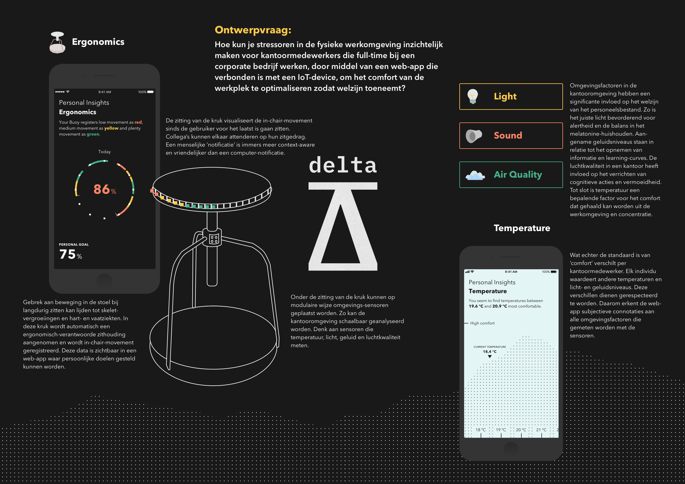

# Delta
Door Daan Rongen, afstudeerstudent major Technology Design, minor Intelligent Environments, focus op IoT-design en design-ethiek.

Volg de progressie op [daanrongen.github.io/delta](https://daanrongen.github.io/delta/) en lees de [design brief](img/design-brief-compressed.pdf) voor het volledige literatuuronderzoek en ontwerpproces.

## Inhoud
* [Introductie](#introductie)
* [Conclusie literatuur- en veldonderzoek](#conclusie-literatuur--en-veldonderzoek)
* [Ontwerpvraag](#ontwerpvraag)
* [Planning en Deliverables](#planning-en-deliverables)

## Introductie
In deze design brief beschrijf ik de urgentie van het probleem dat ik wil oplossen met mijn afstudeerproject aan de studie Communication & Multimedia Design aan de Hogeschool van Amsterdam in opdracht van HR-tech startup Healthy Workers. Het project valt te beschrijven als een intelligente welzijns-interventie dat ergonomie in de werkomgeving verbetert en inzichtelijk maakt met een kruk. Sensoren in de kruk zullen zitduur en *in-chair-movement* registreren waardoor het zitgedrag naar de gebruiker gecommuniceerd kan worden.

In Nederland werken ruim 2.3 miljoen mensen in een kantooromgeving (Stijnenbosch, 2015). Dat is bijna eenderde van de complete beroepsbevolking van Nederland (CBS, 2015). Alhoewel het ziekteverzuim van de gemiddelde Nederlandse kantoormedewerker lager ligt dan bij andere sectoren, is het alsnog niet de meest gezonde werkomgeving om langdurig in te werken. Sterker nog, de kantoortuin is funest voor de mentale gezondheid (van Agteren, 2018). Dit heeft te maken met de hoeveelheid stressoren die aanwezig zijn in de werkomgeving. Stressoren zijn impulsen waarbij het vrijkomen van het stresshormoon wordt bevorderd (Ontstressen.net, n.d.). Deze impulsen kunnen onderverdeeld worden in fysiologische stressoren, zoals kou, (rug)pijn en lawaai, en psychologische stressoren zoals nare herinneringen of slechte relaties met mensen om ons heen. Meer dan een miljoen Nederlandse kantoormedewerkers kampen met burn-out klachten en 36% van al het werk-gerelateerde ziekteverzuim wordt veroorzaakt door stress. Van al deze medewerkers die kampen met stress, vormt de groep jonge medewerkers (leeftijd 25 tot 35 jaar) de grootste groep (TNO, n.d.). Buiten het feit dat het een grote kostenpost is voor bedrijven en dat het bijzonder vervelend is voor de medewerkers, kunnen gevolgen van een ongezonde werk-omgeving ook nog langdurige effecten met zich meebrengen die later in, of zelfs na het beroepsleven, consequenties hebben op zowel de mentale als fysieke gezondheid van de kantoormedewerker. Het is dan ook niet gek dat sinds het begin van de eenentwintigste eeuw de leus "stress op het werk is beroepsziekte nummer één" steeds bekender is geworden.

MKB heeft in samenwerking met Menzis een ‘bedrijfs-gezondheidscheck’ ontwikkeld en laat deze afleggen bij talloze bedrijven. Het doel van de check is om alle bedrijven te laten streven naar gezond en fit personeel en aan te moedigen om te investeren in de gezondheid van de werknemers. Voor de directie van deze bedrijven is het namelijk een win-win om hun personeel zo gezond mogelijk te houden: een toename in productiviteit en een afname in ziekteverzuim. Naast de bedrijfsgezondheidscheck maakt MKB namelijk ook berekeningen hoeveel een zieke werknemer kost per dag voor het bedrijf. Bij hun berekeningen staat het gemiddelde op €410 per dag per zieke werknemer (Klees, 2017). Al met al is het dus bijzonder lucratief om te investeren in welzijn. Het probleem ligt echter bij maatwerk. Welzijn is complex en kan alleen verbeterd worden als er eerst kritisch wordt gekeken naar wat er daadwerkelijk fout gaat in de werkomgeving. Zoals eerder genoemd vertakken de impulsen die invloed hebben op welzijn zich in fysiologische en psychologische stressoren. Beide vertakkingen vergen twee compleet verschillende maatregelen.

Er hebben in de afgelopen decennia veel onderzoeken plaatsgevonden naar welzijn van werknemers in een kantooromgeving. De eerdergenoemde fysiologische stressoren worden voornamelijk veroorzaakt door factoren uit de fysieke werkomgeving. In het meest recente psychologie-onderzoek van de Hanzehogeschool Groningen is gebleken dat voornamelijk de factoren ergonomie, klimaat, licht en geluid de grootste invloed hebben op fysiologische stressoren in de kantooromgeving (Smid, 2016). Het blijkt dat indirecte omgevingsstressoren als klimaat, licht en geluid invloeden hebben op de capabiliteit om cognitieve acties te verrichten, vermoeidheid, alertheid, concentratie en het melatonine-huishouden van de kantoormedewerker. Directe fysieke stressoren, zoals ergonomie, dragen bij aan skeletvergroeiingen en de ontwikkeling van hart- en vaatziekten bij langdurig gebrek aan fysieke activiteit en het aannemen van een ergonomisch onverantwoorde zithouding.

## Conclusie literatuur- en veldonderzoek
Teruggrijpend naar het literatuuronderzoek weet ik dat fysieke stressoren omtrent ergonomie, klimaat, licht en geluid de grootste invloeden op productiviteit, concentratie, learning-curve, tevredenheid met de werkomgeving, stress, en uiteindelijk welzijn hebben. In de interviews tijdens het veldonderzoek wordt bevestigd dat deze meetpunten interessant zijn voor kantoormedewerkers. Sterker nog: kantoormedewerkers zijn zich bewust van wanneer een stressor actief is. Ze kunnen de stressor ook definiëren en zijn in staat om aan te geven in hoeverre ze last hebben van deze stressor. Kantoormedewerkers kunnen echter niet aangeven in hoeverre ze elke factor in de fysieke omgeving ingesteld willen hebben. Deze zijn moeilijk in te schatten.

// resultaten experiment hypothese 1

## Ontwerpvraag
Op basis van de bevindingen uit zowel het literatuuronderzoek als het veldonderzoek heb ik de volgende ontwerpvraag geformuleerd:

> **Hoe kun je fysieke activiteit inzichtelijk maken voor kantoormedewerkers die full-time bij een corporate bedrijf werken, door middel van een web-app die verbonden is met een IoT-device, om fysiek welzijn in de werkomgeving te optimaliseren?**

### Design Challenges
Om het theoretisch kader van het onderzoek en de bevindingen uit het veldonderzoek te concretiseren naar een praktische toepassing, heb ik de volgende design challenges opgesteld:

**1. Hoe kun je middels een ergonomische interventie MSD's en CVD's afzwakken en zitgedrag inzichtelijk maken?**

**2. Hoe kun je ergonomisch-verantwoord zitgedrag aanmoedigen zonder de workflow van de kantoormedewerker te verstoren?**

**3. Hoe kun je zitgedrag inzichtelijk maken door middel van digitale technologie zodat deze informatie systematisch gebruikt kan worden?**

**4. Hoe kun je omgevingsstressoren meetbaar maken met een IoT-device waarbij de sensor-componenten modulair opgebouwd kunnen worden?**

## Planning en Deliverables

